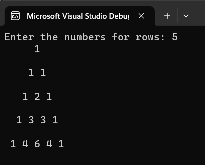

## Pattern

## Aim:
To write a C# program for a pascal's triangle.
## Equipment Required:
Microsoft Visual Studio 2022
## Algorithm:
## Step 1:
Create a new Class.

## Step 2:
Declare two variables of int data type one to store the input from user for no.of rows snd another the value for printing.

## Step 3:
Get the number of rows from the user.

## Step 4:
Using for loop print the rows and columns and space.

## Step 5:
Check the first and last rows of the triange is 1 using if condition.

## Step 6:
Otherwise use else to print the inner value val = val * (i - j + 1) / j

## Step 7:
Print the program.

## Program:
```
Developed by:B.Pavizhi
Register No:212221230077
using System;
namespace PascalTriane
{
    public class pascalPattern
    {
        public static void Main(string[] args)
        {
          
            int rows, i, j, count = 1,k;
            Console.Write("Enter the numbers for rows: ");
            rows = Convert.ToInt32(Console.ReadLine());
            for (i = 0; i < rows; i++)
            {
              for (j = 1; j <= rows - i; j++)
                {
                    Console.Write(" ");
                }
                for (k = 0; k <= i; k++)
                {
                        if (i == 0 || k == 0)
                        {
                            count = 1;
                        }
                        else
                        {
                            count = count * (i - k + 1) / k;
                        }
                        Console.Write("{0} ", count);
                }
                Console.WriteLine("\n");
            }
              
        }
    }
}
```

## Output:


## Result:
     Hence, a C# program for a pascal's triangle is executed successfully.
